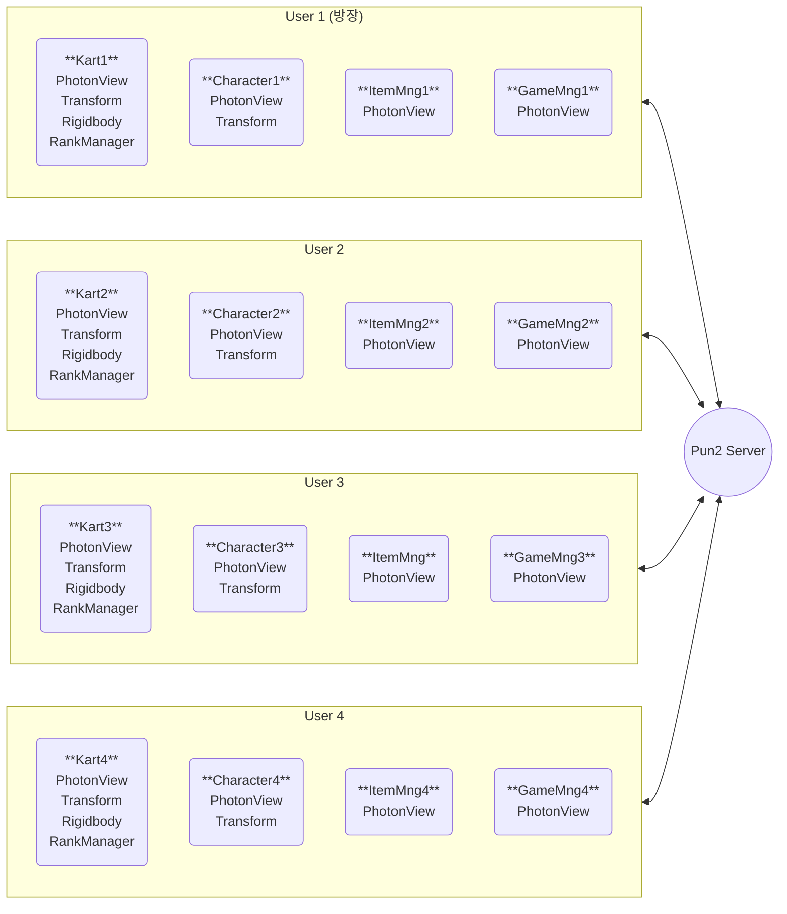
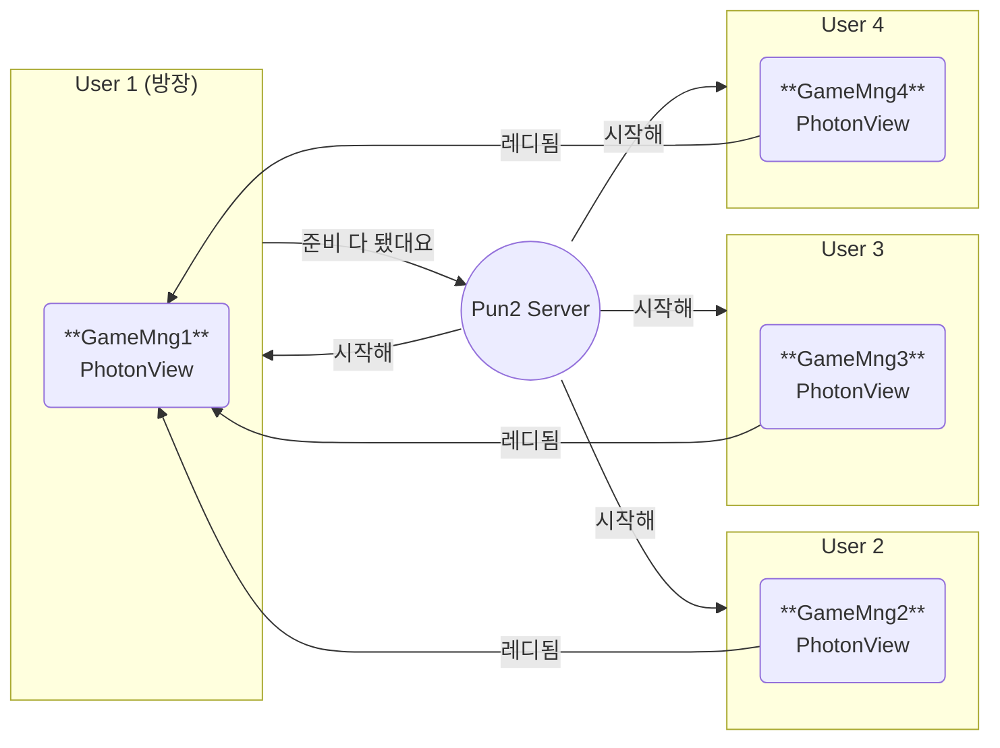
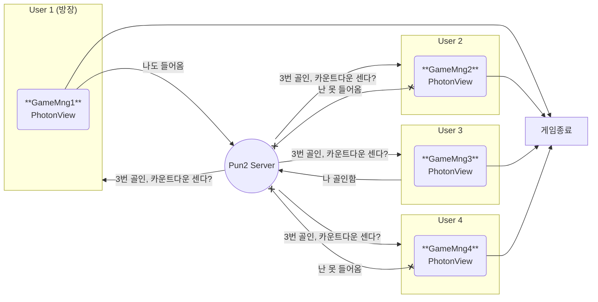
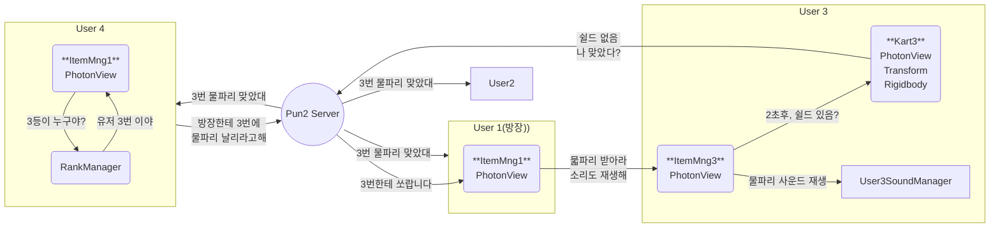
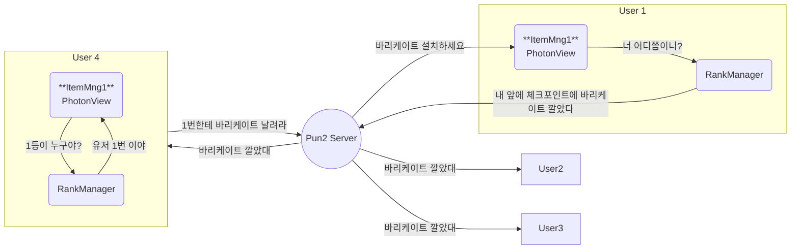

## 인게임씬에 4명이 접속했다는 가정

## 게임 매니저 게임 시작시 실행 과정

## 게임 종료시 실행 과정 (ex : 유저 3번이 골인했다)

## ItemManager 
### 1. 물파리를 날린다.  
- 유저4가 4등, 유저 3이 3등이라고 가정.

### 2. 바리케이트를 날린다.
* 유저 4가 바리케이트 발사, 유저 1이 1등이라고 가정
